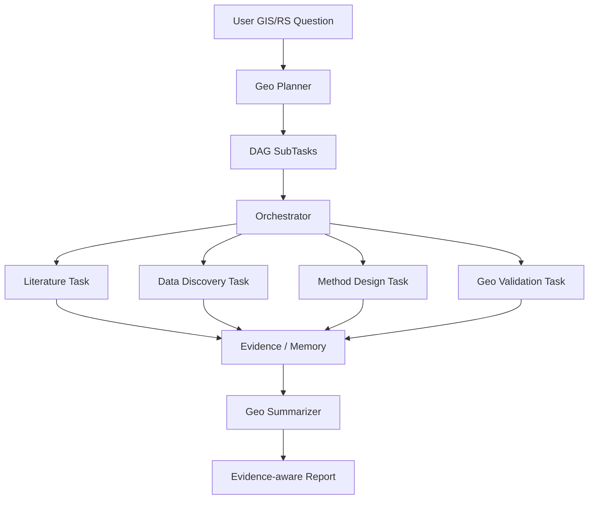

# GeoResearch Agent

面向 GIS / 遥感研究问题的 evidence-aware DeepResearch Agent。

本项目基于一个通用 DeepResearch Agent 代码框架改造，目标不是做简单问答机器人，而是构建一个能围绕 GIS / 遥感研究问题自动拆解任务、检索证据、推荐数据源与方法、检查空间分析风险，并生成结构化研究方案报告的多 Agent 系统。

当前项目处于 MVP 改造阶段：原始 DeepResearch 主流程已跑通，真实 semantic memory / RAG 依赖已可用，正在进行 GIS / 遥感领域化设计与实现。

## 项目定位

传统 LLM 可以回答“城市热岛怎么分析”，但容易出现三个问题：

- 数据源和方法可能来自模型记忆，缺少外部证据。
- 遥感方法与数据不一定匹配，例如错误地用 Sentinel-2 直接反演 LST。
- 报告看起来完整，但缺少 AOI、时间范围、传感器、分辨率、CRS、云量、验证方案等关键空间分析约束。

GeoResearch Agent 的目标是把 LLM 放在“候选生成和解释”的位置，把真实性交给工具、RAG、数据目录和验证规则：

```text
LLM 生成候选方案
  -> 工具 / RAG / registry 查证
  -> Validator 检查数据与方法适配性
  -> 按 Verified / Evidence-backed / Speculative 分级
  -> 生成可追溯研究报告
```

## 当前能力

- 基于 Planner 将复杂研究问题拆解为 DAG 子任务。
- 基于 Orchestrator 状态机调度子任务执行。
- 基于 asyncio + DAG layer scheduling 支持并发执行。
- 基于 Agent tool-calling loop 调用搜索、论文、网页、文件、计算等工具。
- 基于 Memory Store 保存中间结果，并使用 sentence-transformers 进行语义检索、去重和冲突检测。
- 已完成 baseline 运行，能生成一份 Landsat 城市热岛分析流程报告。

## 改造目标

MVP 聚焦“遥感研究方案设计”，暂不做完整遥感影像下载和自动计算。

计划支持：

- GIS / 遥感问题拆解
- AOI、时间范围、传感器、数据源识别
- 遥感数据源候选推荐
- 遥感方法候选推荐
- 数据与方法适配性验证
- 最终报告按可信度分级输出

暂不包含：

- GEE / openEO 自动执行
- 本地大模型推理或训练
- 大规模遥感影像下载
- QGIS 插件
- PostGIS 空间数据库
- 完整生产级 STAC 接入

## 架构概览



核心模块：

| 模块 | 作用 |
|---|---|
| `src/planner` | 将用户问题拆解为 DAG 子任务 |
| `src/orchestrator` | 状态机、并发调度、失败收集、重规划 |
| `src/agents` | Researcher / Summarizer 等 Agent 实现 |
| `src/tools` | 搜索、论文、浏览器、计算、后续 GIS 工具 |
| `src/memory` | 语义记忆、去重、冲突检测 |
| `src/models` | OpenAI-compatible LLM provider 封装 |

## 当前里程碑

- M0：项目副本与环境搭建完成
- M1：原项目主流程 baseline 跑通
- M2：GIS / 遥感领域化 MVP 设计中
- M3：Evidence-aware 数据结构设计待实现
- M4：GIS / 遥感工具待实现
- M5：Demo 与简历展示待整理

详细进度见：[项目日志.md](项目日志.md)。

## 环境准备

Windows PowerShell：

```powershell
cd "D:\研究生\找实习\geo-research-agent"

python -m venv .venv
Set-ExecutionPolicy -Scope Process -ExecutionPolicy Bypass
.\.venv\Scripts\Activate.ps1

python -m pip install -r requirements-minimal.txt -i https://pypi.org/simple
python -m pip install torch --index-url https://download.pytorch.org/whl/cpu
python -m pip install -U sentence-transformers scikit-learn transformers -i https://pypi.tuna.tsinghua.edu.cn/simple --trusted-host pypi.tuna.tsinghua.edu.cn --timeout 120
python -m pip install -e . --no-deps
```

可选数据分析依赖：

```powershell
python -m pip install -U pandas matplotlib -i https://pypi.tuna.tsinghua.edu.cn/simple --trusted-host pypi.tuna.tsinghua.edu.cn --timeout 120
```

## 配置密钥

复制模板：

```powershell
Copy-Item .env.template .env
```

填写至少一个 OpenAI-compatible 后端，例如 DeepSeek：

```text
DEFAULT_LLM_BACKEND=deepseek
DEEPSEEK_API_KEY=your_api_key
DEEPSEEK_BASE_URL=https://api.deepseek.com
DEEPSEEK_MODEL=deepseek-v4-flash
```

注意：`.env` 已被 `.gitignore` 忽略，不要提交密钥。

## Baseline 运行

当前 baseline 使用 mock search，目的是验证主流程，而不是生成真实证据报告。

```powershell
$env:LANGSMITH_TRACING="false"

python -X utf8 scripts\run_single.py `
  --query "简要分析遥感研究中使用 Landsat 进行城市热岛分析的一般流程" `
  --config configs\baseline.yaml `
  --output_dir outputs\baseline `
  --session_id baseline_001 `
  --log_level INFO
```

已验证结果：

- DAG 生成成功
- Orchestrator 调度成功
- Agent tool loop 成功
- Summarizer 生成报告成功
- semantic memory 成功加载 `sentence-transformers/all-MiniLM-L6-v2`

## Geo MVP 运行

当前 GIS/遥感 MVP 使用 `configs/geo_mvp.yaml`。它会启用 GIS/遥感 Planner prompt、新的任务类型和 GIS/遥感报告结构；搜索仍可保持 mock mode，用于验证编排链路。

```powershell
$env:LANGSMITH_TRACING="false"

python -X utf8 scripts\run_single.py `
  --query "如何研究 2018-2024 年武汉城市扩张对地表热环境的影响？" `
  --config configs\geo_mvp.yaml `
  --output_dir outputs\geo_mvp `
  --session_id geo_mvp_m2 `
  --log_level INFO
```

已验证结果：

- Planner 生成 GIS/遥感 DAG
- AgentPool 能按新 `TaskType` 路由 researcher / summarizer
- Summarizer 输出 GIS/遥感研究报告结构
- 报告示例：`outputs/geo_mvp/report_20260525_194006_如何研究_2018-2024_年武汉城市.md`

## 设计文档

- [M2 GIS/遥感 MVP 设计草案](docs/geo_mvp_design.md)

## 计划中的 GIS / 遥感工具

第一批工具计划：

- `dataset_registry_tool`
  - 查询 Landsat、Sentinel、MODIS、ERA5、WorldCover 等数据源适用性。
- `method_registry_tool`
  - 查询 NDVI、NDBI、LST、NDWI、change detection 等方法的公式、所需波段和限制。
- `geo_plan_validator_tool`
  - 检查候选数据与方法是否匹配，并输出验证结果。
- STAC 检索工具
  - 后续接入，用于真实数据可用性验证。

## Demo Query

计划中的第一条 GIS / 遥感 demo：

```text
如何研究 2018-2024 年武汉城市扩张对地表热环境的影响？
```

期望系统输出：

- AOI 和时间范围识别
- Landsat / Sentinel / WorldCover 等数据源推荐
- LST、NDVI、NDBI、城市热岛强度等方法流程
- 数据和方法适配性检查
- 分辨率、云量、季节一致性、验证方案等风险提示
- Evidence-aware 最终报告

## 项目状态说明

当前仓库仍保留原 DeepResearch 框架中的部分模块，例如 adversarial loop、evolution、evaluation 等。这些模块暂时不是 GIS / 遥感 MVP 的核心路径，后续会按需要保留、弱化或重构。

## Git 注意事项

不要提交：

- `.env`
- `.venv/`
- `.setup-logs/`
- `data/`
- 大模型权重和 checkpoint

推荐在关键节点提交：

```powershell
git status
git add .
git commit -m "docs: rewrite readme for geo research agent"
```
