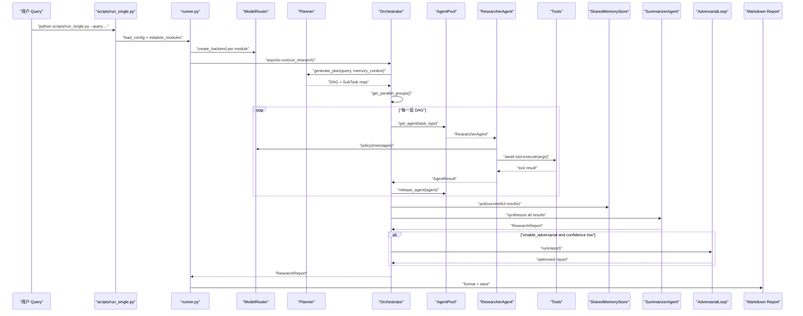

# 01. DeepResearch Agent 架构总览

## 1. 项目目标

DeepResearch Agent 是一个 Python 实现的深度研究型 Agent 系统。它不是简单问答，而是把用户的复杂研究问题拆成多个子任务，并行搜索/分析，再把结果合成为结构化 Markdown 报告。如果报告质量不足，还会进入 Red-Blue 对抗修正流程。

面试中的一句话版本：

> 这个项目是一个自研 DeepResearch Agent。它用 Planner 把复杂 query 拆成 JSON DAG，用 Orchestrator 按依赖关系异步调度多个 ResearcherAgent 调用搜索、浏览器、论文、计算等工具，最后由 SummarizerAgent 合成报告，并通过 Memory、Compressor、Red-Blue Adversarial Loop 提高上下文利用和报告质量。

## 2. 系统边界

系统内部：

- CLI 入口：`scripts/run_single.py`, `scripts/run_repl.py`, `scripts/run_eval.py`
- 模块装配中心：`src/core/runner.py`
- 模型路由：`src/models/model_router.py`, `src/models/vllm_policy.py`
- 规划器：`src/planner/planner.py`, `src/planner/dag.py`
- 编排器：`src/orchestrator/orchestrator.py`, `src/orchestrator/agent_pool.py`, `src/orchestrator/schemas.py`
- Agent：`src/agents/researcher.py`, `src/agents/summarizer.py`
- 工具层：`src/tools/*.py`
- 记忆：`src/memory/memory_store.py`, `src/memory/long_term.py`, `src/memory/embedder.py`
- 压缩：`src/compressor/*.py`
- 对抗修正：`src/adversarial/*.py`
- 评测：`evaluation/`, `scripts/run_eval.py`, `scripts/run_ablation.py`

系统外部依赖：

- LLM 后端：DeepSeek、MiMo、OpenAI 或本地 vLLM，走 OpenAI-compatible API。
- 搜索后端：SerpAPI、Bing、Bocha、Metaso 等。
- 网页抓取：`aiohttp` + `BeautifulSoup`。
- 向量模型：`sentence-transformers`。
- 持久化：SQLite。
- 配置：`.env` / `.env.local` + YAML。

## 3. 工程骨架摘要

| 类型 | 文件 | 作用 |
|---|---|---|
| 包管理 | `pyproject.toml` | Python 3.10+、依赖、命令行入口、black/isort/mypy 配置 |
| 依赖清单 | `requirements.txt` | 运行依赖和可选依赖说明 |
| 环境变量 | `.env.template`, `.env.tools.template` | API Key、Base URL、工具后端、超时、LangSmith |
| 行为配置 | `configs/default.yaml` | 模型分工、采样参数、并发、Memory、Adversarial、Tools |
| 运行入口 | `scripts/run_single.py` | 单条 query 研究任务 |
| 核心装配 | `src/core/runner.py` | 初始化全部模块并启动 `orchestrator.run()` |
| 测试/验证 | `tests/validate_env.py`, `tests/demo.py` | 检查环境变量和工具运行 |

## 4. 高层组件

| 组件 | 职责 | 关键文件 |
|---|---|---|
| Runner | 读取配置、初始化模块、启动研究流程、保存报告 | `src/core/runner.py`, `scripts/run_single.py` |
| ModelRouter / VLLMPolicy | 从 `.env` 创建 OpenAI-compatible LLM 后端，处理 tool calling、截断和错误 | `src/models/model_router.py`, `src/models/vllm_policy.py` |
| Planner | 把 query 拆成 JSON 子任务，解析为 DAG，失败时 replan | `src/planner/planner.py`, `src/planner/dag.py` |
| Orchestrator | 状态机驱动，按 DAG 分层并发调度 Agent，收集结果，触发合成/对抗 | `src/orchestrator/orchestrator.py` |
| AgentPool | 复用 ResearcherAgent/SummarizerAgent，减少重复创建 | `src/orchestrator/agent_pool.py` |
| ResearcherAgent | 多轮 tool-calling：LLM 决定工具，执行工具，再继续总结 | `src/agents/researcher.py` |
| SummarizerAgent | 单轮长上下文报告合成，解析引用和置信度 | `src/agents/summarizer.py` |
| Tools | 搜索、网页阅读、论文、本地文件、计算、代码沙箱、笔记 | `src/tools/*.py` |
| Memory | 写入子任务结果和最终报告，支持 embedding 检索、去重、矛盾检测 | `src/memory/*.py` |
| Compressor | 长上下文压缩，避免提示词过长 | `src/compressor/*.py` |
| AdversarialLoop | Red Agent 找问题，Blue Agent 修复，并判断收敛/震荡 | `src/adversarial/*.py` |
| Evaluation | 规则指标、Judge、消融实验、benchmark | `evaluation/*.py`, `scripts/run_eval.py` |

## 5. 主数据流

## 6. 为什么这样设计

这个架构的核心思想是分层：

- `scripts/` 只做命令行交互，不负责业务逻辑。
- `runner.py` 做依赖装配，把各模块实例组装起来。
- `Planner` 只负责规划，不执行工具。
- `Orchestrator` 只负责任务调度、状态转换和降级。
- `ResearcherAgent` 负责执行单个子任务和工具调用。
- `SummarizerAgent` 负责最终报告合成。
- `Memory`、`Compressor`、`Adversarial` 是质量增强模块，不污染主启动入口。

这种设计在面试中好讲，因为每个模块“为什么存在”比较清楚：Planner 解决复杂问题拆解，Orchestrator 解决并发和依赖，Tools 解决外部信息获取，Memory 解决跨任务上下文，Adversarial 解决报告质量。

## 7. 技术选型与取舍

| 技术 | 使用位置 | 为什么适合 | 替代方案 | 取舍 |
|---|---|---|---|---|
| Python 3.10+ | 全项目 | 适合快速开发 Agent、工具、评测脚本 | TypeScript、Go | Python 运行性能一般，但 AI 生态强 |
| `asyncio` | Orchestrator、Tools、脚本 | 适合大量 I/O 等待：LLM、搜索、网页抓取 | 多线程、LangGraph | 自研调度需要自己处理状态和异常 |
| YAML 配置 | `configs/default.yaml` | 层级清晰，适合模块参数 | TOML、JSON、Hydra | 没有强 schema，配置错误运行时才暴露 |
| `.env` | API Key、Base URL | 避免密钥硬编码 | 云密钥管理、系统环境变量 | 本地开发方便，生产环境需更严格 |
| OpenAI-compatible API | `VLLMPolicy` | 统一 DeepSeek、MiMo、OpenAI、vLLM 调用 | LangChain ChatModel | 自己封装更可控，但要处理工具调用细节 |
| JSON DAG | Planner 输出 | LLM 容易生成，Orchestrator 容易解析 | LangGraph 图对象 | JSON 解析需要兜底，DAG 合法性要校验 |
| Tool Calling | ResearcherAgent | 让 LLM 决定搜索、浏览、计算等动作 | 规则路由、固定 pipeline | 需要控制工具调用轮数和失败处理 |
| SQLite | LongTermMemory | 零运维、适合本地持久化 | Postgres、Chroma、FAISS | 规模大时检索和并发有限 |
| sentence-transformers | Memory/Compressor | 本地 embedding，成本低 | OpenAI Embedding、bge-m3 | 模型质量和速度受本地环境影响 |
| Red-Blue Loop | Adversarial | 让报告生成后再被审查和修复 | LLM-as-Judge only、人工审阅 | 额外消耗模型调用，不能完全替代引文验证 |

## 8. 运行特性

并发模型：

- 主入口 `run_single.py` 用 `asyncio.run()` 进入异步流程。
- `Orchestrator._do_dispatching()` 用 `asyncio.Semaphore` 限制最大并发。
- 同一 DAG layer 用 `asyncio.gather()` 并行。
- 单个任务用 `asyncio.wait_for()` 设置超时。
- 同步 LLM 调用在 `ResearcherAgent` 中通过 `asyncio.to_thread()` 放到线程池，避免阻塞事件循环。

配置模型：

- `.env` / `.env.local` 存 API Key 和 URL。
- `configs/default.yaml` 存模块级行为参数。
- `ModelRouter` 把两者合并成 `VLLMPolicy`。

失败降级：

- Planner JSON 解析失败抛 `PlanParseError`。
- 单任务超时变成 `AgentStatus.TIMEOUT`。
- 失败率高时进入 `REPLANNING`。
- 合成失败时生成降级报告。
- 搜索工具可以使用 Mock 模式。

可观测性：

- `setup_logging()` 配置基础日志。
- `trace_chain` / `trace_agent` / `trace_tool` 接入 LangSmith 风格追踪。
- `scripts/run_single.py` 用 `Tee` 同时把终端输出写入日志文件。

## 9. 分阶段学习路线

| 阶段 | 时间建议 | 学什么 | 目标 |
|---|---:|---|---|
| 1 | 0.5 天 | Python 项目骨架：`pyproject`、`requirements`、`.env`、YAML、CLI | 能解释项目怎么启动和怎么配置 |
| 2 | 1 天 | Runner + 数据结构：`runner.py`、`schemas.py` | 能讲清模块如何被初始化，数据对象怎么流动 |
| 3 | 1 天 | Planner + DAG：`planner.py`、`dag.py` | 能讲清复杂 query 如何拆成可并发任务 |
| 4 | 1.5 天 | Orchestrator：状态机、`Semaphore`、`gather`、`wait_for` | 能讲清异步调度和失败重规划 |
| 5 | 1.5 天 | ResearcherAgent + Tools | 能讲清 tool-calling loop 和工具执行 |
| 6 | 1 天 | Memory + Compressor | 能讲清共享记忆、embedding、上下文压缩 |
| 7 | 1 天 | Summarizer + Adversarial | 能讲清最终报告合成和 Red-Blue 修正 |
| 8 | 0.5 天 | Evaluation + 简历包装 | 能回答项目亮点、缺陷、改进计划 |

## 10. 已验证事实和推断

已验证：

- 单条 query 入口是 `scripts/run_single.py`，内部调用 `asyncio.run(run_research(...))`。
- `runner.py` 初始化 ModelRouter、Planner、Compressor、Memory、Tools、AdversarialLoop、AgentPool、Orchestrator。
- 核心数据结构在 `src/orchestrator/schemas.py`，使用 dataclass 和 Enum。
- Planner 输出 JSON，并解析为 `DAG`。
- Orchestrator 使用状态机、DAG layer、Semaphore、gather、wait_for。
- ResearcherAgent 使用 OpenAI tool schema，并通过 `await tool.execute(...)` 执行工具。
- WebSearchTool 和 BrowserTool 使用 `aiohttp` 异步 HTTP。
- Memory 使用 SQLite + numpy 向量索引。
- `.env` / `.env.local` 的加载逻辑在 `src/utils/env_config.py`。

推断：

- 这个项目面试主线最适合包装成“自研 Agent 调度框架”，不是简单 RAG 问答。
- M6 Evolution 模块更像预留或实验性质，简历上不宜放在主亮点第一位。
- 当前引用 grounding 主要来自工具轨迹启发式提取，严谨性还可以增强。

未知或待运行确认：

- 当前本地是否已配置可用 API Key。
- 真实搜索后端是否稳定。
- 全量评测脚本是否能在当前机器和网络环境跑通。

