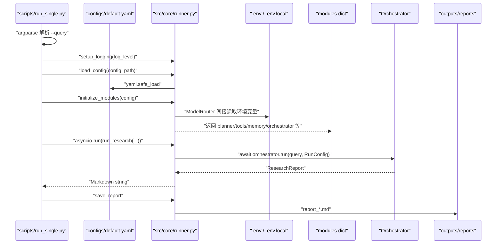

# 02. 模块：CLI、配置与 Runner 装配

## 1. 模块职责

这个模块负责把“用户在命令行输入的问题”变成“项目内部已经初始化好的 Agent 运行环境”。

它不负责规划、搜索、报告合成；它负责：

1. 解析命令行参数。
2. 读取 YAML 配置。
3. 初始化模型、工具、记忆、压缩器、对抗循环、AgentPool、Orchestrator。
4. 调用异步研究主流程。
5. 保存 Markdown 报告。

## 2. 关键文件

| 文件 | 作用 |
|---|---|
| `scripts/run_single.py` | 单条 query 的命令行入口 |
| `scripts/run_repl.py` | 交互式连续研究入口 |
| `src/core/runner.py` | 真正的模块装配中心 |
| `configs/default.yaml` | 全局运行配置 |
| `.env.template` | LLM 和工具后端连接信息模板 |
| `src/utils/env_config.py` | `.env` / `.env.local` 加载 |
| `pyproject.toml` | 命令行入口和 Python 包配置 |

## 3. 运行流程



## 4. 核心函数

### `scripts/run_single.py::main()`

你第一遍只看这几步：

```python
config = load_config(args.config)
modules = initialize_modules(config, session_id=args.session_id)
report = asyncio.run(run_research(args.query, config, modules))
filepath = save_report(report, args.query, args.output_dir)
```

读法：

- `load_config()`：读 YAML。
- `initialize_modules()`：把系统需要的对象全部创建出来。
- `asyncio.run()`：从同步 CLI 进入异步 Agent 主流程。
- `save_report()`：把最终字符串写成 Markdown。

### `runner.py::load_config()`

```python
with open(config_path, "r", encoding="utf-8") as f:
    config = yaml.safe_load(f)
```

它只做一件事：把 YAML 变成 Python 字典。

### `runner.py::initialize_modules()`

这是本模块最重要的函数。它创建：

| modules key | 实例 | 用途 |
|---|---|---|
| `default_policy` | `VLLMPolicy` | 默认 LLM 后端 |
| `planner_policy` 等 | `VLLMPolicy` | 模块级 LLM 后端 |
| `planner` | `Planner` | query 拆 DAG |
| `compressor` | `ContextCompressor` | 长上下文压缩 |
| `memory_store` | `SharedMemoryStore` | 跨 Agent 记忆 |
| `tools` | list | 搜索、浏览器、计算等工具 |
| `adversarial` | `AdversarialLoop` | Red-Blue 修正 |
| `agent_pool` | `AgentPool` | Agent 对象池 |
| `orchestrator` | `Orchestrator` | 主编排器 |

### `runner.py::run_research()`

这个函数是异步的：

```python
async def run_research(query: str, config: dict, modules: dict[str, Any]) -> str:
    report = await orchestrator.run(query, config=run_cfg)
    await WebSearchTool.close_session()
    return _format_report(report, elapsed)
```

它把 YAML 中的并发、超时、重规划、对抗开关转换成 `RunConfig`，再交给 Orchestrator。

## 5. 配置如何影响这个模块

### 模型后端

`configs/default.yaml`：

```yaml
model:
  backend: "deepseek"
  backend_mapping:
    planner: "deepseek"
    solver: "deepseek"
    judge: "mimo"
```

`runner.py` 会遍历 `backend_mapping`，为每个模块创建一个独立 policy：

```python
for module_name, backend_name in backend_mapping.items():
    modules[f"{module_name}_policy"] = ModelRouter.create_backend(backend_name, **kwargs)
```

### 工具模式

```yaml
tools:
  web_search:
    mock_mode: false
```

`mock_mode=true` 时，`runner.py` 创建 `MockWebSearchTool` 和 `MockBrowserTool`，适合无 API Key 调试。

`mock_mode=false` 时，创建真实 `WebSearchTool` 和 `BrowserTool`，需要 `.env.local` 中有搜索后端 Key。

### 运行参数

```yaml
orchestrator:
  max_concurrent: 5
  global_timeout_seconds: 600
  max_replan_rounds: 3
```

这些值会进入：

```python
RunConfig(max_concurrent=..., global_timeout_seconds=..., max_replan_rounds=...)
```

## 6. 需要掌握的 Python 语法

### `argparse`

`run_single.py` 用 `argparse` 定义命令行参数：

```python
parser.add_argument("--query", type=str, required=True)
```

这表示 `--query` 必填。

### `asyncio.run`

普通 `main()` 不能直接使用 `await`，所以用：

```python
report = asyncio.run(run_research(...))
```

### 字典装配

`modules` 是一个字典，不是类：

```python
modules["planner"] = planner
modules["orchestrator"] = orchestrator
```

这样好处是装配灵活；坏处是 key 写错不会被类型系统发现。

### `lambda`

```python
agent_pool = AgentPool(
    policy_factory=lambda: modules.get("solver_policy", default_policy),
    tools_factory=lambda: list(modules["tools"]),
)
```

`lambda` 是匿名函数。这里的意思是：AgentPool 需要创建 Agent 时，再调用这个函数拿 policy 和 tools。

## 7. 第一遍、第二遍、面试读法

第一遍：

- 看 `run_single.py` 的 `main()`。
- 找到 `load_config`、`initialize_modules`、`run_research`、`save_report`。
- 不要深入每个模块内部。

第二遍：

- 看 `initialize_modules()` 每一段初始化顺序。
- 对照 `configs/default.yaml`，理解每个 config key 用在哪里。
- 看 `env_config.py`，理解 `.env.local` 为什么优先。

面试读法：

- 能解释“为什么 Runner 不是直接把逻辑全写在 CLI 里”。
- 能解释“为什么敏感信息用 `.env`，行为参数用 YAML”。
- 能解释“怎么切换模型后端和 mock 工具”。

## 8. 小练习

给定配置：

```yaml
tools:
  web_search:
    mock_mode: true
```

请你沿着 `runner.py::_create_tools_factory()` 追踪：

1. `web_search` 会创建真实工具还是 Mock 工具？
2. `browser` 会创建真实工具还是 Mock 工具？
3. 这种设置适合什么场景？

参考答案：

1. `MockWebSearchTool`
2. `MockBrowserTool`
3. 适合没有 API Key 或不想产生外部网络调用时调试主流程。

## 9. 调试命令

```bash
python tests/validate_env.py
python scripts/run_single.py --query "测试 DeepResearch Agent 主流程" --log_level INFO
```

如果没有 API Key，先把 `configs/default.yaml` 里的 `tools.web_search.mock_mode` 改成 `true` 再跑。

## 10. 证据

- CLI 入口：`scripts/run_single.py`
- 模块装配：`src/core/runner.py`
- YAML 配置：`configs/default.yaml`
- 环境变量加载：`src/utils/env_config.py`
- 包入口：`pyproject.toml`
- 环境验证：`tests/validate_env.py`

