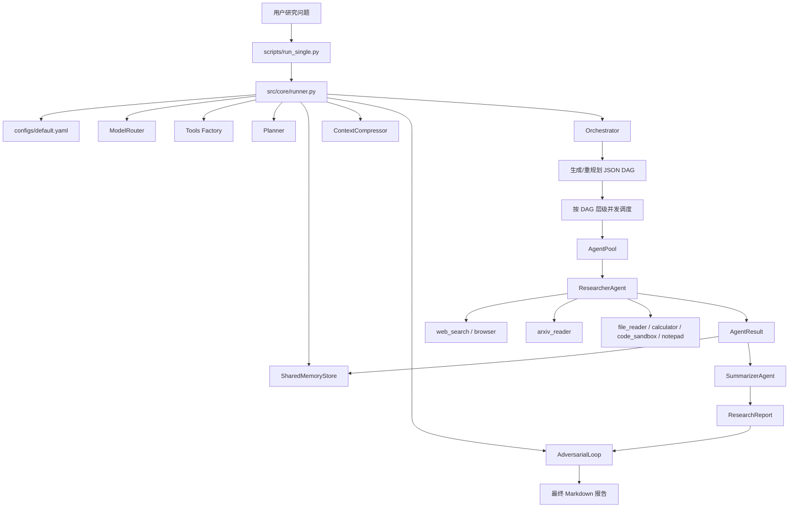
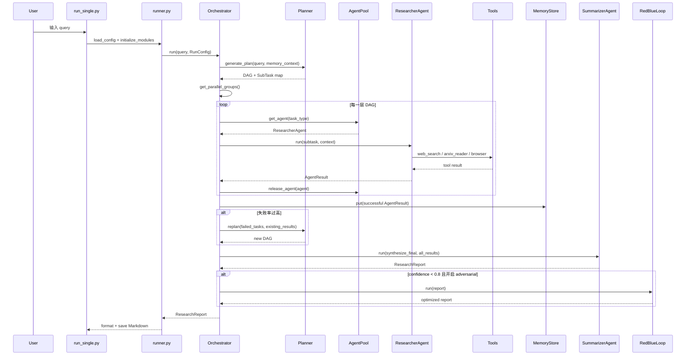

# 当前项目总体架构

当前仓库是一个 Python 实现的 DeepResearch Agent。它不是基于 LangGraph/AutoGen 的图框架，而是自己实现了：

- LLM 模型路由：`ModelRouter`
- 研究规划：`Planner`
- DAG 调度：`Orchestrator`
- Agent 对象池：`AgentPool`
- 工具调用循环：`ResearcherAgent`
- 报告合成：`SummarizerAgent`
- 共享记忆：`SharedMemoryStore`
- 对抗修正：`AdversarialLoop`
- 评测体系：`evaluation/`

## 目录职责

```text
deepresearch-agent/
  configs/             配置中心，控制模型、工具、并发、memory、adversarial 等
  scripts/             命令行入口，如 run_single.py、run_repl.py、run_eval.py
  src/core/            启动、初始化、运行主流程
  src/models/          多后端 LLM 路由，兼容 OpenAI 风格接口
  src/planner/         把研究问题拆成 JSON DAG
  src/orchestrator/    状态机、DAG 调度、AgentPool
  src/agents/          ResearcherAgent 与 SummarizerAgent
  src/tools/           web_search、browser、arxiv_reader、calculator 等工具
  src/memory/          SQLite + embedding 的共享记忆
  src/compressor/      长上下文压缩
  src/adversarial/     Red-Blue 对抗审查和修复
  src/evolution/       自进化接口，目前偏预留
  evaluation/          benchmark、metrics、judge、消融实验
```

## 总体架构图



## 运行时序图



## 核心数据结构

核心 schema 在 `src/orchestrator/schemas.py`：

- `SubTask`：Planner 输出的原子任务。
- `AgentResult`：一个子任务执行后的结果。
- `ResearchReport`：最终交付的报告对象。
- `RunConfig`：一次运行的并发、超时、重规划、对抗开关。
- `TaskType`：`search`、`analyze`、`verify`。
- `AgentStatus`：`success`、`failed`、`timeout`。
- `OrchestratorState`：状态机枚举。

## 一次任务的主链路

1. `scripts/run_single.py` 解析命令行参数。
2. `runner.load_config()` 读取 YAML。
3. `runner.initialize_modules()` 初始化模型、工具、Planner、Memory、Adversarial、Orchestrator。
4. `runner.run_research()` 构造 `RunConfig`，调用 `orchestrator.run()`。
5. `Orchestrator` 进入状态机：
   - `PLANNING`：调用 Planner 生成 DAG。
   - `DISPATCHING`：按 DAG 分层并发运行子任务。
   - `COLLECTING`：收集结果，写入 memory，判断是否 replan。
   - `SYNTHESIZING`：调用 Summarizer 合成报告。
   - `ADVERSARIAL`：低置信度报告进入 Red-Blue 修正。
6. `runner._format_report()` 把 `ResearchReport` 变成 Markdown。
7. `runner.save_report()` 写入 `outputs/reports`。

## 面试时的架构表达

可以这样讲：

> 这个项目是一个自研 DeepResearch Agent。它把用户研究问题先交给 Planner 拆成 JSON DAG，然后 Orchestrator 根据 DAG 依赖关系做分层并发调度。每个子任务由 ResearcherAgent 执行，它通过 OpenAI 风格 tool-calling 调用网页搜索、浏览器、论文检索等工具。子任务结果写入共享 Memory，最后 SummarizerAgent 汇总成带 sources 的 Markdown 报告。如果报告置信度不足，还会进入 Red-Blue adversarial loop，由 RedAgent 找问题、BlueAgent 修复。模型侧通过 ModelRouter 支持模块级后端路由。

## 当前架构的优点

- 调度逻辑清晰：DAG + 状态机容易讲。
- 工具层比较独立：适合扩展 GIS/遥感工具。
- 支持并发：`asyncio.Semaphore` 控制子任务并行。
- 配置集中：模型后端、工具开关、对抗参数都在 YAML。
- 有评测和消融实验目录，适合包装成实习项目。

## 当前架构的不足

- citation grounding 不严格：sources 主要从 tool trajectory 启发式提取。
- Planner 不是领域化的：还不知道 GIS/遥感研究该拆哪些维度。
- 工具没有领域数据源：缺少 STAC、Earthdata、OpenAlex 深度字段、GEE catalog。
- Memory 更像经验缓存，不是严谨 evidence store。
- 对抗修正能改善文本质量，但不能替代引用验证。

