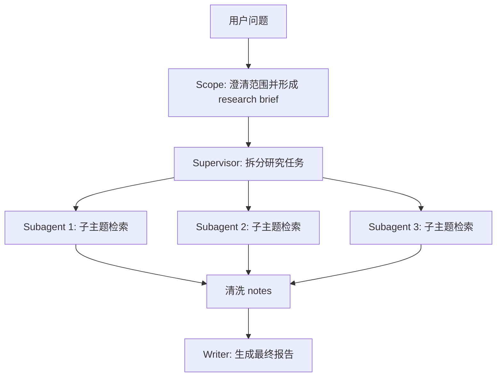
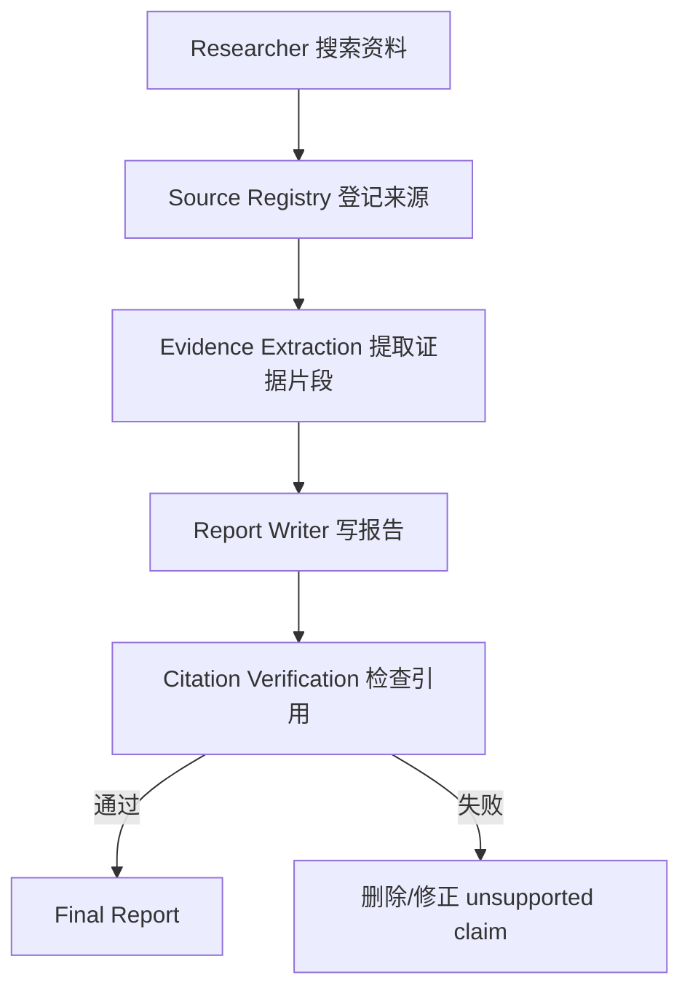
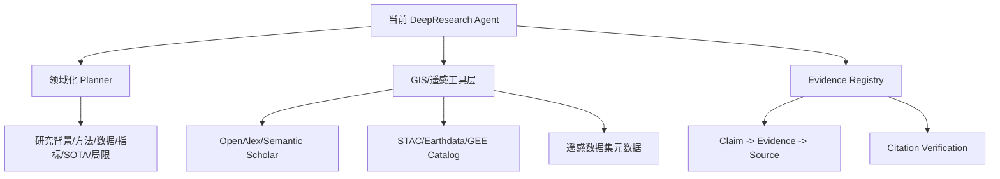

# DeepResearch Agent 主流设计架构

这个文件帮助你把当前开源项目放到更大的技术图谱里。面试时不要只说“我 clone 了一个项目”，要能说明它属于哪一类架构、和主流方案有什么差异、你准备怎么改。

## 1. 产品型 Deep Research：长程浏览 + 推理 + 报告

OpenAI 的 deep research 系统强调：模型会自主浏览网页、解释和分析大量文本、图片与 PDF，并在遇到新信息后调整搜索方向。它的特点是“长程任务 + 浏览能力 + 多步推理 + 综合报告”。

参考：

- [OpenAI Deep Research System Card](https://openai.com/index/deep-research-system-card/)
- [OpenAI BrowseComp](https://openai.com/index/browsecomp/)

适合学习的点：

- DeepResearch 不只是搜索，而是搜索、阅读、判断、改写搜索方向。
- 长程浏览 Agent 的难点包括事实可靠性、引用准确性、置信度校准。
- 报告质量不仅取决于 LLM，还取决于工具、检索策略、证据选择。

对本项目的启发：

- 需要记录每个 claim 来自哪个 source。
- 需要允许搜索策略根据中间发现动态改变。
- 需要明确“不确定”和“证据不足”的表达。

## 2. LangChain / LangGraph：Scope → Research → Write

LangChain Open Deep Research 的典型流程是：

参考：

- [LangChain Open Deep Research](https://www.langchain.com/blog/open-deep-research)
- [LangChain Deep Agents](https://www.langchain.com/deep-agents)
- [LangChain Subagents Docs](https://docs.langchain.com/oss/python/deepagents/subagents)

适合学习的点：

- Supervisor 不应该把所有网页内容都塞进自己的上下文，而是让子 Agent 各自研究，再返回压缩后的 findings。
- 研究阶段适合多 Agent 并行，写报告阶段适合集中合成。
- 子 Agent 可以有自己的 prompt、工具和上下文，降低主 Agent 的认知负担。

和本项目对比：

| 维度 | LangChain/LangGraph | 当前项目 |
|---|---|---|
| 编排方式 | 图框架 / StateGraph | 自研状态机 + DAG |
| 子代理 | Supervisor 调 subagent | Orchestrator 调 AgentPool |
| 状态管理 | Graph state | `_memory_store` + SharedMemoryStore |
| 任务拆分 | Supervisor / planner prompt | Planner 输出 JSON DAG |
| 优点 | 框架成熟，生态强 | 调度逻辑透明，适合面试讲 |
| 缺点 | 框架抽象多 | 需要自己保证边界和可靠性 |

## 3. NVIDIA AI-Q：Citation Registry + Verification

NVIDIA 的 Deep Researcher 蓝图强调 Citation Registry 和 Citation Verification：研究过程会维护 source registry，最终报告中的引用需要能回溯到真实来源。

参考：

- [NVIDIA Deep Researcher Agent](https://docs.nvidia.com/aiq-blueprint/2.0.0/architecture/agents/deep-researcher.html)

典型思路：

适合学习的点：

- 引用不是最后用正则从文本里抓 URL，而是研究阶段就登记。
- 每个 source 有稳定编号，报告中的 citation 指向 registry。
- verification 可以是确定性检查：引用编号是否存在、URL 是否可访问、snippet 是否支持 claim。

对 GeoResearch Agent 的启发：

- 新增 `Evidence` 和 `Source` 数据结构。
- 每个工具返回结果时就写入 evidence registry。
- 报告生成时要求每个关键结论引用 evidence id。
- 最终增加 citation audit：未引用、无来源、来源不支持的 claim 都要标记。

## 4. 极简 Recursive Search：Depth / Breadth

一些轻量开源项目采用递归搜索：

1. 根据问题生成多个搜索 query。
2. 搜索网页。
3. 从网页中提炼 learnings。
4. 根据 learnings 继续生成下一层 query。
5. 达到 depth 或 token budget 后写报告。

代表项目：

- [dzhng/deep-research](https://github.com/dzhng/deep-research)

适合学习的点：

- 架构简单，容易实现。
- 适合快速验证工具和 prompt。
- 但缺少复杂依赖、并行调度、严格状态机。

和本项目对比：

当前项目更复杂，因为它用 DAG 表达任务依赖，而不是简单递归深度。面试时可以说：递归搜索适合简单 research bot，DAG 调度更适合复杂研究任务，因为有些子问题必须先完成，后续分析才能依赖它。

## 5. GeoResearch Agent 应选择的架构

建议不要完全推翻当前项目，而是在它的自研 DAG 框架上增强三件事：

一句话定位：

> GeoResearch Agent 是面向 GIS、遥感与时空智能研究的领域化 DeepResearch Agent。它在通用 DeepResearch 的规划、检索、合成基础上，加入领域数据源、论文证据管理、遥感数据集元数据检索和引用校验，生成可追溯的研究报告。

