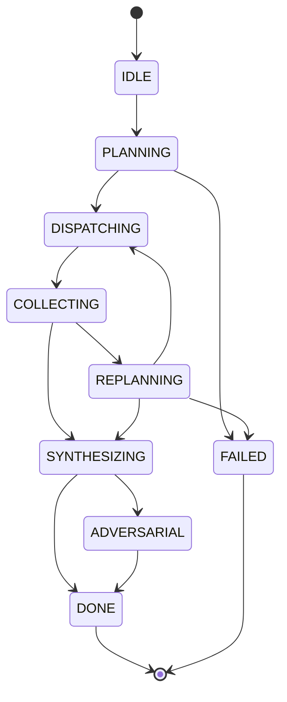
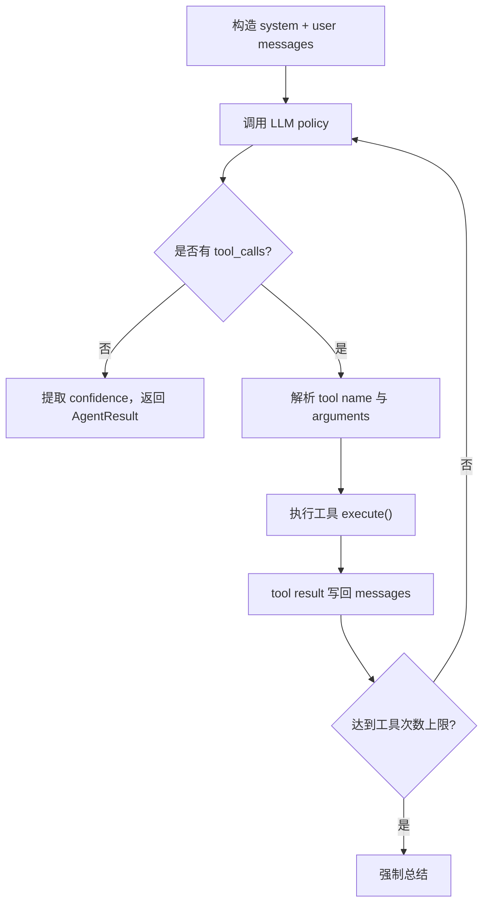

# 源码模块逐个拆解

## 1. CLI 与 Runner

相关文件：

- `scripts/run_single.py`
- `src/core/runner.py`

职责：

- 解析命令行参数。
- 加载 YAML 配置。
- 初始化所有模块。
- 调用 Orchestrator。
- 保存最终 Markdown 报告。

关键函数：

- `load_config(config_path)`
- `_create_tools_factory(config)`
- `initialize_modules(config, session_id)`
- `run_research(query, config, modules)`
- `save_report(report, query, output_dir)`

阅读重点：

`initialize_modules()` 是整个项目的装配中心。你可以把它理解成一个简易依赖注入容器：先创建模型，再创建 Planner、Compressor、Memory、Tools、AdversarialLoop，最后把这些依赖传给 Orchestrator。

面试表达：

> runner 层负责工程启动和依赖装配，业务编排不写在 CLI 脚本里，而是统一封装在 `src/core/runner.py`，这样 scripts 和 evaluation 都能复用同一套初始化逻辑。

## 2. ModelRouter

相关文件：

- `src/models/model_router.py`
- `src/models/vllm_policy.py`
- `configs/default.yaml`

职责：

- 根据配置创建不同 LLM 后端。
- 支持 DeepSeek、vLLM、OpenAI、MiMo 等 OpenAI-compatible API。
- 支持模块级模型分配。

关键设计：

```yaml
backend_mapping:
  solver: "deepseek"
  planner: "deepseek"
  summarizer: "deepseek"
  judge: "mimo"
  red_agent: "mimo"
  blue_agent: "mimo"
  compressor: "mimo"
```

阅读重点：

- `ModelRouter.create_backend()`
- `_load_backend_config()`
- `_BACKEND_CACHE`

面试表达：

> 我把不同 Agent 角色映射到不同模型后端，例如规划和研究用强模型，对抗评审和压缩用低成本模型，这样能在效果和成本之间做工程取舍。

## 3. Planner

相关文件：

- `src/planner/planner.py`
- `src/planner/dag.py`
- `src/planner/budget_tracker.py`

职责：

- 把用户 query 拆成 3-8 个结构化 `SubTask`。
- 输出 JSON，并转成 DAG。
- 在失败时根据 failed tasks 和 preserved results 重规划。

核心输入输出：

```json
{
  "sub_tasks": [
    {
      "task_id": "task_1",
      "task_type": "search",
      "description": "Search recent papers about ...",
      "dependencies": [],
      "context_keys": [],
      "timeout_seconds": 120,
      "priority": 1,
      "expected_type": "factual",
      "search_hints": ["keyword1", "keyword2"]
    }
  ]
}
```

阅读重点：

- `INITIAL_PLAN_PROMPT`
- `generate_plan()`
- `replan()`
- `_parse_plan()`
- `get_task_map_from_dag()`

注意点：

当前 Planner 是通用研究 Planner，不懂 GIS/遥感。GeoResearch Agent 后续应该让它按领域范式拆解：

- 研究任务定义
- 相关论文与方法谱系
- 遥感数据集与传感器
- 空间尺度与时间尺度
- 评价指标
- SOTA 对比
- 局限与开放问题

## 4. Orchestrator

相关文件：

- `src/orchestrator/orchestrator.py`
- `src/orchestrator/agent_pool.py`
- `src/orchestrator/schemas.py`

职责：

- 维护状态机。
- 调 Planner。
- 按 DAG 依赖并发执行子任务。
- 收集结果、写 memory、判断是否重规划。
- 调 Summarizer 和 AdversarialLoop。

状态机：



阅读重点：

- `run()`
- `_do_planning()`
- `_do_dispatching()`
- `_do_collecting()`
- `_should_replan()`
- `_do_synthesizing()`
- `_do_adversarial()`
- `_do_replanning()`

关键 Python：

- `asyncio.Semaphore`
- `asyncio.gather`
- `asyncio.wait_for`
- 字典映射状态处理器：`self._state_handlers`

面试表达：

> Orchestrator 是这个项目最核心的后端工程模块。它把 LLM 生成的计划转成可执行 DAG，然后按拓扑层级并发调度子任务。每个任务有独立超时，失败率过高时会触发 replan，最终即使部分失败也会尽量基于已有结果降级生成报告。

## 5. AgentPool

相关文件：

- `src/orchestrator/agent_pool.py`

职责：

- 延迟创建 Agent。
- 复用空闲 Agent。
- 根据 `TaskType` 路由到不同 Agent 实现。
- 避免每次子任务都重复创建对象。

阅读重点：

- `get_agent(task_type)`
- `release_agent(agent)`
- `_create_agent(type_key)`

当前实现：

`search`、`analyze`、`verify` 最终都创建 `ResearcherAgent`，只是命名不同。`SummarizerAgent` 在 Orchestrator 合成阶段单独处理。

## 6. ResearcherAgent

相关文件：

- `src/agents/researcher.py`

职责：

- 根据子任务构造 prompt。
- 设置工具 schema。
- 调用 LLM policy。
- 解析 `tool_calls`。
- 执行工具并把结果追加回 messages。
- 没有工具调用或达到限制后返回 `AgentResult`。

核心循环：



阅读重点：

- `run()`
- `_system_prompt()`
- `_build_task_prompt()`
- `_execute_tool()`
- `_extract_confidence()`

注意点：

当前每个 ResearcherAgent 最多工具调用 2 次，这能控制成本，但对真正 deep research 可能偏少。GeoResearch Agent 可以按任务类型配置不同工具预算，例如论文综述任务 5 次、数据集元数据任务 3 次、事实核查任务 2 次。

## 7. Tools

相关文件：

- `src/tools/web_search.py`
- `src/tools/browser.py`
- `src/tools/arxiv_reader.py`
- `src/tools/file_reader.py`
- `src/tools/calculator.py`
- `src/tools/code_sandbox.py`
- `src/tools/notepad.py`

工具接口共同点：

- 有 `name`
- 有 `description`
- 有 `get_openai_tool_schema()`
- 有 `async execute(...)`

当前工具能力：

- `web_search`：SerpAPI / Bing / Bocha / Metaso
- `browser`：读取网页正文
- `arxiv_reader`：ArXiv / Semantic Scholar / OpenAlex
- `file_reader`：读取本地文件
- `calculator`：轻量数学计算
- `code_sandbox`：Python 代码执行
- `notepad`：中间笔记

GeoResearch Agent 应新增：

- `openalex_paper_search`
- `stac_catalog_search`
- `earthdata_search`
- `gee_dataset_search`
- `remote_sensing_dataset_reader`
- `geospatial_metric_explainer`

## 8. SummarizerAgent

相关文件：

- `src/agents/summarizer.py`

职责：

- 收集所有 `AgentResult`。
- 按 confidence 排序。
- 构造合成 prompt。
- 调 LLM 生成 Markdown。
- 从 trajectory 中提取 sources。
- 计算总体 confidence。

阅读重点：

- `_build_synthesis_prompt()`
- `_parse_report()`

当前不足：

sources 是从工具调用轨迹里启发式抽取的，并没有保证报告中的每个关键 claim 都被 source 支持。后续应改成 Evidence Registry。

## 9. MemoryStore

相关文件：

- `src/memory/memory_store.py`
- `src/memory/long_term.py`
- `src/memory/embedder.py`
- `src/memory/short_term.py`

职责：

- 把成功的子任务结果持久化。
- 用 embedding 做相似检索。
- 写入前做垃圾内容过滤。
- 做去重和启发式冲突检测。
- 给 Planner 提供历史 memory context。

阅读重点：

- `SharedMemoryStore.__init__()`
- `put()`
- `get_context_for_query()`
- `_find_duplicate()`
- `_detect_conflicts()`

面试表达：

> Memory 模块不是简单 list，而是 SQLite 持久化加内存向量索引。它能做 session 隔离、相似记忆召回、去重和冲突检测，为后续 multi-session research 和 evidence reuse 打基础。

## 10. Compressor

相关文件：

- `src/compressor/compressor.py`
- `src/compressor/extractive.py`
- `src/compressor/sliding_window.py`
- `src/compressor/summarizer.py`

职责：

- 当上下文太长时压缩。
- 结合 embedding 相似度、TextRank、摘要模型。

当前使用位置：

- Orchestrator 在构造 memory context 时，如果内容过长，会调用 compressor。

## 11. AdversarialLoop

相关文件：

- `src/adversarial/loop.py`
- `src/adversarial/red_agent.py`
- `src/adversarial/blue_agent.py`
- `src/adversarial/verdict.py`

职责：

- RedAgent 审查报告问题。
- BlueAgent 根据问题修复报告。
- Judge 或 verdict 机制判断是否收敛。

阅读重点：

- `AdversarialLoop.run()`
- RedAgent 的 critique 维度
- BlueAgent 的 patch 策略

注意点：

对抗修正是文本质量优化，不等于事实验证。它可以发现逻辑漏洞、覆盖不足、引用薄弱，但如果底层没有 evidence registry，仍可能修出更流畅但未必更可靠的文本。

## 12. Evaluation

相关文件：

- `evaluation/metrics.py`
- `evaluation/report.py`
- `evaluation/run_baseline.py`
- `evaluation/benchmarks/research_bench.py`
- `evaluation/metrics/*.py`

职责：

- 规则指标。
- LLM-as-Judge。
- benchmark 运行。
- 消融实验。

面试表达：

> 这个项目不只做 demo，还保留了 evaluation pipeline，包括规则指标、judge-based 指标、benchmark 和消融实验。后续我会把 GeoResearch Agent 的评测扩成领域任务，例如论文覆盖率、引用可验证率、数据集元数据准确率、方法对比完整度。

