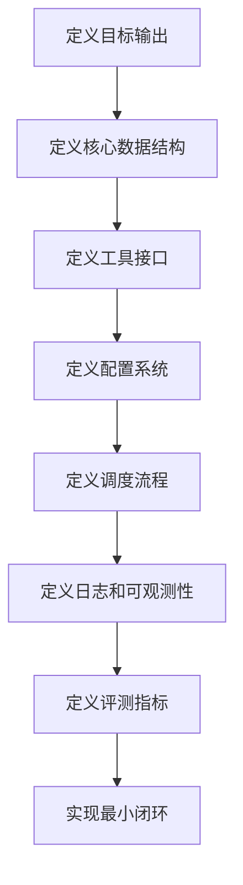

# 环境配置与项目基础知识

这份笔记解释启动和理解当前项目所需的前置知识：依赖安装、`.env` 配置、包管理、`__init__.py`、YAML 配置、注释与日志。重点是读懂这个仓库为什么这样组织，以及你后续从零设计 GeoResearch Agent 时应该保留哪些原则。

## 1. 环境配置总览

当前项目启动依赖四类文件：

```text
requirements.txt       给 pip 安装运行依赖
pyproject.toml         Python 包元数据、构建配置、可选依赖、工具配置
.env.template          环境变量模板，主要放 API key / base url / model name
.env.tools.template    工具层环境变量模板，主要放搜索、浏览器、文件读取等工具配置
configs/default.yaml   业务配置，控制模型分工、并发、memory、adversarial、tools 等
```

合理的职责划分应该是：

| 文件 | 放什么 | 不放什么 |
|---|---|---|
| `requirements.txt` | 直接安装的依赖版本 | API key、业务参数 |
| `pyproject.toml` | 包元数据、可选依赖、命令行入口、格式化工具配置 | 私密配置 |
| `.env` / `.env.local` | API key、base url、本地路径、部署环境变量 | 可提交到 Git 的内容 |
| `configs/*.yaml` | 可复现的业务参数、模块开关、采样参数、超时并发 | 密钥 |

这背后的工程原则是：代码、依赖、配置、密钥分离。

## 2. 推荐本地环境配置流程

在 Windows PowerShell 下建议这样做：

```powershell
python -m venv .venv
.\.venv\Scripts\Activate.ps1
python -m pip install --upgrade pip
pip install -r requirements.txt
```

然后配置环境变量：

```powershell
Copy-Item .env.template .env.local
```

编辑 `.env.local`，至少填写：

```env
DEFAULT_LLM_BACKEND=deepseek
DEEPSEEK_API_KEY=your_key
DEEPSEEK_BASE_URL=https://api.deepseek.com
DEEPSEEK_MODEL=deepseek-chat

SEARCH_BACKEND=bocha
BOCHA_API_KEY=your_key
BOCHA_API_ENDPOINT=https://api.bochaai.com/v1/web-search

ARXIV_READER_BACKEND=openalex
OPENALEX_EMAIL=your_email@example.com
```

当前项目 `.gitignore` 已经忽略：

```text
.env
.env.local
.env.*.local
.venv/
venv/
data/
outputs/**/*.log
```

这意味着真实 key 不应该提交。

## 3. requirements.txt 怎么理解

`requirements.txt` 是 pip 的直接安装清单。当前项目主要依赖：

| 依赖 | 用途 |
|---|---|
| `openai` | 调用 OpenAI-compatible LLM API，包括 DeepSeek、vLLM、MiMo |
| `aiohttp` | 异步 HTTP 请求，用于搜索、网页读取、论文 API |
| `pyyaml` | 读取 `configs/default.yaml` |
| `python-dotenv` | 读取 `.env` / `.env.local` |
| `sentence-transformers` | Memory 和 Compressor 的 embedding |
| `networkx` | TextRank 或图算法 |
| `scikit-learn` | 相似度、评测指标 |
| `datasets` | 评测数据集加载 |
| `pandas` / `matplotlib` | 实验分析和可视化 |
| `beautifulsoup4` | BrowserTool 抽取 HTML 正文 |

当前 `requirements.txt` 里有一个需要注意的问题：注释里写了类似 `pip install -r requirements.txt[train]`，这不是 pip extras 的正确用法。`requirements.txt` 本身不支持这种 extras 写法。extras 是 `pyproject.toml` 的能力，正确方式通常是：

```powershell
pip install -e ".[dev]"
pip install -e ".[serve]"
pip install -e ".[train]"
```

所以：

- 只想运行项目：`pip install -r requirements.txt`
- 想按包安装并使用 extras：`pip install -e ".[dev]"`

## 4. pyproject.toml 是什么

`pyproject.toml` 是现代 Python 项目的标准配置文件。它可以同时配置：

- 构建系统：`[build-system]`
- 项目元数据：`[project]`
- 依赖：`dependencies`
- 可选依赖：`[project.optional-dependencies]`
- 命令行入口：`[project.scripts]`
- setuptools 打包规则：`[tool.setuptools]`
- black、isort、mypy 等工具配置：`[tool.black]`、`[tool.isort]`、`[tool.mypy]`

当前项目里：

```toml
[build-system]
requires = ["setuptools>=61.0", "wheel"]
build-backend = "setuptools.build_meta"
```

含义：用 setuptools 构建这个 Python 包。

```toml
[project.scripts]
run-research = "scripts.run_single:main"
```

含义：如果你执行 `pip install -e .`，理论上会生成命令行脚本 `run-research`，它会调用 `scripts/run_single.py` 里的 `main()`。

```toml
[tool.setuptools]
packages = ["src", "evaluation", "scripts", "configs"]
```

含义：告诉 setuptools 哪些目录作为 Python 包发布。这里有个工程上可以改进的点：`configs` 是配置目录，不一定适合作为 Python 包；如果要随包分发 YAML，通常更严格地配置 package data。

官方资料：

- [Writing your pyproject.toml](https://packaging.python.org/guides/writing-pyproject-toml/)
- [pyproject.toml specification](https://packaging.python.org/en/latest/specifications/pyproject-toml/)
- [setuptools pyproject.toml configuration](https://setuptools.pypa.io/en/latest/userguide/pyproject_config.html)

## 5. 包管理与 import 结构

当前项目源码在 `src/` 目录下，但它不是标准的 `src/deep_research_agent/...` 命名，而是直接把 `src` 当包名使用：

```python
from src.core.runner import initialize_modules
from src.tools import WebSearchTool
from src.orchestrator.schemas import RunConfig
```

这能运行，但从工程规范上看，长期更推荐：

```text
src/
  georesearch_agent/
    __init__.py
    core/
    tools/
    planner/
```

然后 import：

```python
from georesearch_agent.core.runner import initialize_modules
```

原因：

- `src` 只是布局名称，不适合作为业务包名。
- 包名应该表达项目身份。
- 发布到 PyPI 或复用为库时更清晰。

当前项目为了保证脚本能直接跑，在 `runner.py` 里做了：

```python
PROJECT_ROOT = Path(__file__).resolve().parent.parent.parent
if str(PROJECT_ROOT) not in sys.path:
    sys.path.insert(0, str(PROJECT_ROOT))
```

这是一种脚本项目常见做法，但不是最干净的包化方式。后续你做 GeoResearch Agent 时，可以考虑把包名重构成 `georesearch_agent`。

## 6. __init__.py 是怎么来的，作用是什么

`__init__.py` 不是自动生成的魔法文件，通常是开发者创建的。它的作用：

1. 标记目录是 Python package。
2. 控制包级别导出。
3. 放包版本号。
4. 避免或管理循环导入。

简单 demo：

```text
my_pkg/
  __init__.py
  tools.py
```

`my_pkg/__init__.py`：

```python
from .tools import WebSearchTool

__all__ = ["WebSearchTool"]
```

外部就可以：

```python
from my_pkg import WebSearchTool
```

当前项目例子：

`src/__init__.py`：

```python
__version__ = "0.1.0"
__all__ = ["__version__"]
```

`src/tools/__init__.py` 会集中导出工具类：

```python
from .web_search import WebSearchTool, MockWebSearchTool, BaseWebSearchTool
from .arxiv_reader import ArxivReaderTool
...
__all__ = ["WebSearchTool", "MockWebSearchTool", ...]
```

所以 `runner.py` 可以写：

```python
from src.tools import WebSearchTool, MockWebSearchTool, ArxivReaderTool
```

但 `src/agents/__init__.py` 和 `src/orchestrator/__init__.py` 刻意不导入具体类，注释里说明是为了避免循环导入。这个判断是合理的：Agent、Orchestrator、Schemas 互相引用较多，过度在 `__init__.py` 导出会增加循环导入风险。

经验规则：

- 工具类、纯函数、轻依赖对象可以在 `__init__.py` 导出。
- 复杂模块、互相依赖模块不要急着在 `__init__.py` 里导出。
- `__init__.py` 不应该执行重逻辑、读配置、发网络请求。

## 7. YAML 配置是怎么设计出来的

YAML 是一种人类可读的数据序列化格式。它适合写配置，因为比 JSON 更适合注释和层级结构。

当前 `configs/default.yaml` 的结构可以看成模块树：

```yaml
system:
  name: "DeepResearchAgent"
  version: "0.1.0"
  log_level: "INFO"

model:
  backend: "deepseek"
  backend_sampling:
    deepseek:
      temperature: 0.7
      max_tokens: 4096
    modules:
      planner:
        temperature: 0.3
  backend_mapping:
    solver: "deepseek"
    planner: "deepseek"

orchestrator:
  max_concurrent: 5
  global_timeout_seconds: 600

tools:
  web_search:
    enabled: true
    mock_mode: false
```

读取代码在 `runner.py`：

```python
with open(config_path, "r", encoding="utf-8") as f:
    config = yaml.safe_load(f)
```

然后模块通过字典取值：

```python
model_cfg = config.get("model", {})
default_backend = model_cfg.get("backend", "vllm")
```

YAML 配置的生成方法不是自动生成，而是从模块参数反推：

1. 每个模块先定义需要哪些参数。
2. 把参数按模块归类。
3. 给每个参数设置默认值。
4. 把敏感项移到 `.env`。
5. 在代码里用 `config.get(..., default)` 做兼容。

对当前项目来说，配置分层是合理的：

- `model`：模型后端和采样参数。
- `orchestrator`：并发、超时、重规划。
- `planner`：规划行为开关。
- `compressor`：上下文压缩预算。
- `memory`：数据库路径、去重阈值。
- `adversarial`：对抗轮数、收敛阈值。
- `evolution`：预留训练参数。
- `tools`：工具开关和默认参数。

YAML 资料：

- [Official YAML Wiki](https://yaml.wiki/about/)
- [YAML 1.2 specification](https://yaml.org/spec/1.2.2/)

## 8. .env 与 YAML 的边界

这个项目的边界设计是：

- `.env`：连接信息和部署差异。
- YAML：业务逻辑参数。

例如：

`.env.local`：

```env
DEEPSEEK_API_KEY=...
DEEPSEEK_BASE_URL=https://api.deepseek.com
DEEPSEEK_MODEL=deepseek-chat
```

`configs/default.yaml`：

```yaml
model:
  backend_mapping:
    planner: "deepseek"
  backend_sampling:
    modules:
      planner:
        temperature: 0.3
        max_tokens: 4096
```

这样做的好处：

- API key 不进入 Git。
- 业务实验参数可以进入 Git，便于复现。
- 不同机器只需要换 `.env.local`，不用改源码。

环境变量加载代码在 `src/utils/env_config.py`：

```python
load_dotenv(dotenv_path=".env")
load_dotenv(dotenv_path=".env.local", override=True)
```

含义：

1. 先加载 `.env`。
2. 再加载 `.env.local`。
3. `.env.local` 优先级更高。

这符合 12-factor app 的配置思想：部署差异通过环境变量注入，而不是硬编码到代码里。

资料：

- [The Twelve-Factor App: Config](https://12factor.net/config)
- [python-dotenv](https://github.com/theskumar/python-dotenv)

## 9. 日志配置

当前项目有两层日志/观测：

1. Python 标准 logging。
2. LangSmith tracing。

### Python logging

`runner.py` 中：

```python
def setup_logging(log_level: str = "INFO") -> None:
    logging.basicConfig(
        level=getattr(logging, log_level.upper(), logging.INFO),
        format="[%(asctime)s] [%(levelname)s] %(name)s: %(message)s",
        datefmt="%Y-%m-%d %H:%M:%S",
    )
```

含义：

- 设置全局日志级别。
- 日志格式包括时间、级别、logger 名称和消息。
- 各模块可以使用：

```python
logger = logging.getLogger("runner")
logger.info("message")
logger.exception("error")
```

`scripts/run_single.py` 还实现了一个 `Tee`，把 stdout/stderr 同时输出到终端和 log 文件：

```python
sys.stdout = Tee(sys.stdout, log_file)
sys.stderr = Tee(sys.stderr, log_file)
```

这在实验脚本里实用，但生产服务里更推荐使用 `logging.FileHandler` 或结构化日志。

日志资料：

- [Python Logging HOWTO](https://docs.python.org/3/howto/logging.html)
- [Python logging cookbook](https://docs.python.org/3/howto/logging-cookbook.html)

### LangSmith tracing

`src/utils/tracing.py` 提供：

- `trace_agent`
- `trace_tool`
- `trace_chain`
- `trace_retriever`
- `trace_block`
- `maybe_wrap_openai_client`

它的设计是“可开关、低侵入”：

```python
def is_tracing_enabled() -> bool:
    return get_env("LANGSMITH_TRACING", "").lower() in ("true", "1", "yes")
```

如果 `.env.local` 中：

```env
LANGSMITH_TRACING=true
LANGSMITH_API_KEY=...
```

则关键函数上的装饰器会启用追踪。否则装饰器直接返回原函数，不影响业务逻辑。

## 10. 注释与文档字符串怎么写

当前项目大量使用模块级 docstring：

```python
"""
src/core/runner.py
DeepResearch Agent 核心运行逻辑。
"""
```

这种注释适合解释“模块职责”和“设计意图”。但真正读代码时，还需要区分三种注释：

| 类型 | 应该写什么 | 不应该写什么 |
|---|---|---|
| 模块 docstring | 模块职责、入口、关键设计 | 重复每行代码 |
| 函数 docstring | 参数、返回值、异常、流程摘要 | 和函数名完全重复 |
| 行内注释 | 非显然的工程原因、边界情况 | `x = x + 1  # x 加 1` |

好的注释例子：

```python
# LLM 可能返回 markdown code block，这里先抽取内部 JSON。
code_block_match = re.search(...)
```

差的注释例子：

```python
# 遍历列表
for item in items:
```

对 Agent 项目来说，注释重点应该解释：

- 为什么这个模块存在。
- 为什么这里要降级。
- 为什么这里限制并发。
- 为什么这里把 key 放进 `.env` 而不是 YAML。
- 为什么这里不在 `__init__.py` 导出，避免循环导入。

## 11. 从零到一设计这类项目的理念

如果你从零设计 GeoResearch Agent，建议按这个顺序设计，而不是先写 Agent prompt：



### Step 1：先定义输出

例如 GeoResearch Agent 的最终输出不是“聊天回答”，而是：

- Markdown 研究报告。
- 结构化 sources。
- claim-level evidence。
- 运行元数据：耗时、搜索次数、失败任务、置信度。

### Step 2：定义数据结构

先定义：

- `ResearchQuery`
- `SubTask`
- `ToolResult`
- `Source`
- `Evidence`
- `AgentResult`
- `ResearchReport`

数据结构稳定后，模块边界才清楚。

### Step 3：定义工具接口

所有工具统一：

```python
class BaseTool:
    name: str
    description: str

    def get_openai_tool_schema(self) -> dict:
        ...

    async def execute(self, **kwargs) -> dict:
        ...
```

这样 ResearcherAgent 不关心工具内部是 OpenAlex、STAC、Earthdata 还是本地文件。

### Step 4：定义配置系统

建议：

- `configs/default.yaml`：默认业务配置。
- `configs/geo.yaml`：领域化配置。
- `.env.local`：本地密钥。
- `pyproject.toml`：包管理和开发工具。

### Step 5：实现最小闭环

最小可行版本：

```text
query -> planner -> one researcher -> one paper search tool -> summarizer -> report
```

跑通后再加：

- 并发 DAG。
- memory。
- citation verification。
- adversarial loop。
- evaluation。

不要一开始把所有模块都写满。Agent 项目的复杂度主要来自模块交互，最小闭环比一次性大而全更可控。

## 12. 推荐品读资料

### Python 项目工程化

- [Python Packaging User Guide: Writing your pyproject.toml](https://packaging.python.org/guides/writing-pyproject-toml/)
- [pyproject.toml specification](https://packaging.python.org/en/latest/specifications/pyproject-toml/)
- [setuptools: Configuring setuptools using pyproject.toml files](https://setuptools.pypa.io/en/latest/userguide/pyproject_config.html)
- [Python Logging HOWTO](https://docs.python.org/3/howto/logging.html)
- [The Twelve-Factor App: Config](https://12factor.net/config)

### Agent 与 DeepResearch 架构

- [LangChain Open Deep Research](https://www.langchain.com/blog/open-deep-research)
- [LangChain Deep Agents](https://docs.langchain.com/oss/python/deepagents/overview)
- [LangChain Subagents](https://docs.langchain.com/oss/python/deepagents/subagents)
- [NVIDIA Deep Researcher Agent](https://docs.nvidia.com/aiq-blueprint/2.0.0/architecture/agents/deep-researcher.html)
- [OpenAI Deep Research System Card](https://openai.com/index/deep-research-system-card/)

### 配置与数据格式

- [Official YAML Wiki](https://yaml.wiki/about/)
- [YAML 1.2.2 Specification](https://yaml.org/spec/1.2.2/)
- [python-dotenv](https://github.com/theskumar/python-dotenv)

### 建议阅读顺序

1. 先读 Twelve-Factor App 的 Config，理解为什么 key 放 `.env`。
2. 再读 Python Packaging 的 `pyproject.toml`，理解包管理。
3. 再读 Python Logging HOWTO，理解日志基本模型。
4. 然后读 LangChain Open Deep Research，理解 scope/research/write。
5. 最后读 NVIDIA Deep Researcher，看 citation registry 和 verification 怎么设计。

## 13. 你当前阶段应该掌握的检查清单

读完这份后，你应该能回答：

- 为什么 `requirements.txt` 和 `pyproject.toml` 都存在？
- `.env.local` 和 `configs/default.yaml` 分别放什么？
- `__init__.py` 是自动生成的吗？它有什么作用？
- 为什么有些包的 `__init__.py` 不导出类？
- YAML 配置如何被 `runner.py` 读取？
- 当前日志是如何输出到终端和文件的？
- LangSmith tracing 和 logging 的区别是什么？
- 如果从零设计 GeoResearch Agent，应该先定义 prompt，还是先定义数据结构和工具接口？

答案倾向：先定义数据结构和工具接口，再写 prompt。

